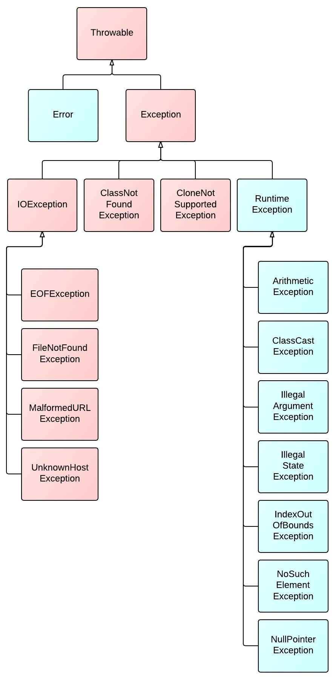
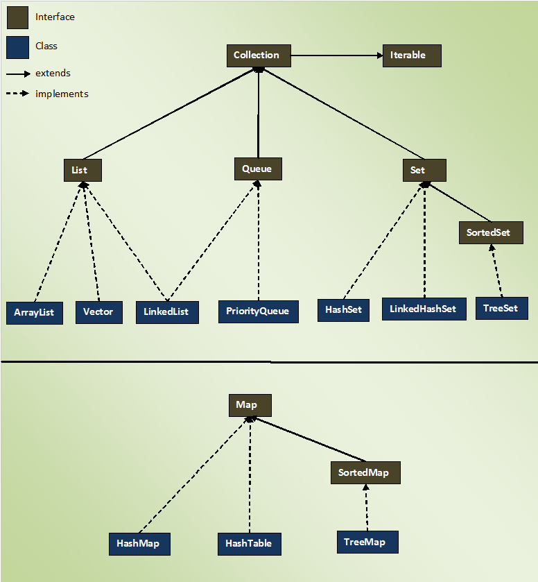

# Java

## Java Introduction
- high level
    - automatic memory management (no developer pointers, garbage collection handled for you)
    -  There is no explicit way to force garbage collection, but you are allowed to request it (System.gc(), Runtime.getRuntime().gc(), System.runFinalize())
- compiled
    - source code is all compiled together and then it can be run
- statically typed
    - must declare variable types
- strongly typed
    - can not coerce data types
- OOP
    - makes use of classes and objects
- Write Once, Run Anywhere
    - Anyone with a JRE and JVM can run a java app
- rich open source community
    - vast ammount of libraries you can add to your program
## class/object
|class|object|
|-----|------|
|declared using class keyword| declared using new keyword|
|declared once|declared as many times as needed|
|no memory allocated when created|memory allocated when created|
|blueprint for creating objects|instatiated class|
```java
public class myClass {

}
// public = access modifier
// class = needed for class declaration
// myClass = name of class
```
## jdk, jre, jvm
- JVM
    - the jvm takes compiled java code and runs it. if a computer has a jvm it can run java code
- JRE
    - the jre contains the runtime libraries necessary for a java app to run, and it houses the jvm too
- JDK
    - the jdk contains developer tools (compiler, debuger, documentation tools, etc.) that allow for the creation of java apps
## pillars of oop
- Abstraction
    - you don't need to know why code works to be able to use it
- Polymorphism
    - objects can behave differently in different contexts
        - Overriding and Overloading are clear examples
        - Overriding happens when you take method from a parent and change its implementation in a child class
        - Overloading is where you have a method with the same name but different parameters that all do different things
- Inheritance
    - classes can acquire behaviors(methods) and attributes(fields) other than those defined in their class
        - child class can inherit variables and methods from parent
- Encapsulation
    - classes can protect their behaviors and attributes by making them private and designating specific means of interacting with their content
    - this provides a level of protection for the class: it prevents unintentional interaction with class data
## Operators
```java
+ // addition
- // subtraction
/ // division
* // multiplication
% // modulus (the remainder in division)
++ // increase value by 1
-- // decrease value by 1

// comparison operators return a True or False value

== // equal to
!= // not equal to
> // greater than
< // less than
>= // greater or equal to
<= // less than or equal to

// logical operators are used further facilitate the comparison operators
&& // logical and returns true of both statements are true
|| // logical or returns true if one of the statements is true
! // not operator reverses the desired outcome: will return false if the expression is true, and vice versa
```
## methods & parameters
```java
class myClass{
    public static void myBasicMethod(){
        System.out.println("This is where the code for the method goes");
    }
}
// public = access modifier
// static = non-access modifier keyword. Allows access to the method without instantiation
// void = return type. void indicates there is nothing to return
// myBasicMethod = name of the method
// () = any paramaters for the method are listed here
```
## Constructors
Constructors are special methods that determine how classes are to be instantiated as objects. They handle the build logic
```java
public class myClass{
    int myInt;
    String myString;

    // this is a basic "no args" constructor
    public myClass(){
        // every constructor calls super() (or this()) as its first line of code, whether you place it or not
    }

    // this is a constructor that only initializes one variable
    public myClass(int myInt){
        this.myInt = myInt;
    }

    // this is a constructor that initializes both variables
    public myClass(int myInt, String myString){
        this.myInt = myInt;
        this.myString = myString;
    }

    // this is a constructor that takes in an argument for one variable and sets a default for the other
    public myClass(String myString){
        this.myInt = 0;
        this.myString = myString;
    }
}
```
## Inheritance
Classes can extend one other class: this allows them to inherit the variables and methods in the parent class
```java
class ParentClass {
    public String parentClassString;

    public ParentClass(String parentClassString){
        this.parentClassString = parentClassString;
    }
}
class ChildClass extends ParentClass{

    String childClassString;

    public ChildClass(String parentClassString, String childClassString) {
        super(parentClassString);
        this.childClassString = childClassString;
    }

    public static void main(String[] args) {
        ChildClass child = new ChildClass("this is the parent string", "this is the child string");
        System.out.println(child.parentClassString); // this is provided by the parent class
        System.out.println(child.childClassString); // this is provided by the child class
    }

}
```
## Interfaces
Interfaces are like "contracts" that give classes access to the variables and methods they contain
```java
// this is a marker interface: no functionality provided, just used for structure
public interface MyInterface {
}
```
## Abstract Class
They work like normal classes, except they can't be instantiated. Useful for inheritance
```java
// this shows a class extend an abstract class and implement an interface

public interface MyInterface {
    int interfaceNumber = 7;

    public void myInterfaceMethod();
}
public abstract class MyAbstractClass {
    public String abstractClassString = "This string is part of the abstract class";

    public void abstractClassMethod(){
        System.out.println("this method is provided by the abstract class");
    }
}
public class Playground extends MyAbstractClass implements MyInterface {
    public static void main(String[] args) {
        Playground app = new Playground(); // need to instantiate
        app.abstractClassMethod(); // provided by abstract class
        System.out.println(app.abstractClassString); // provided by abstract class
        app.myInterfaceMethod();// provided by interface
        System.out.println(app.interfaceNumber); // provided by interface
    }

    @Override
    public void myInterfaceMethod() { // this is where we define the interface method
        System.out.println("this method is provided by the interface, must be made concrete");
    }
}
```
Key differences between abstract classes and interfaces:
|Abstract|Interface|
|--------|---------|
|class can't be instantiated|contract can't be instantiated|
|instance variable/access modifiers|public static final variables|
|concrete methods allowed|abstract methods(see default/static section)|
|can only inherit one class|can implement multiple interfaces|
## Default/Static Interface Methods
Since Java 8, Interfaces can have default methods, which provide functionality immediately without the need to be overridden (still can be overridden). They can also have static methods, which can not be overridden and are accessed by calling the interface itself. This allows for functional(esque) programming
```java
public interface DefaultInterface {

    default void sayHello(){
        System.out.println("this prints hello by default, can be overridden");
    }

    static void staticMethod(){
        System.out.println("You can print this by referencing the interface, can't be overridden");
    }
```
## control flow
these keywords control the flow of logic and code execution in your program
```java
// if statements only run when their indicated logic is achieved
int x = 5;
if(x == 5){
    System.out.println("this is true");
}

// you can include an else statement that will run if your if block does not run
int x = 5;
if(x==6){
    System.out.println("this is true");
} else {
    System.out.println("this is not true");
}

// you can utilize else if statements to add more potential triggers
int x = 7
if(x==5){
    System.out.println("this is not true, so it will not trigger")
} else if (x == 7){
    System.out.println("this block of code will trigger because x = 7")
} else if (x == 8){
    System.out.println("This also will not trigger")
} else {
    System.out.println("this will not trigger because the else if is going to trigger")
}

// for loops reexecute the same block of code until their condition is met
for (int x = 0; x < 10; x++){ //(declaration;condition;declaration)
    System.out.println(x);
}

// enhanced for loops can iterate through an object that implements the iterable interface
int[] myInts = new int[]{1,2,3,4,5};
for (int num : myInts){
    System.out.println(num);
}

// while loops test a condition and execute code in a loop till the condition is no longer true
int x = 0;
while (x < 10){
    System.out.println(x);
    x++;
}

// do while loops work the same as above, except the code executed in the do executes at least once
int x = 10
do{
    System.out.println("this prints once despite x !< 10")
} while (x < 10);

// switch statements take a variable and execute code based upon the given value
// can take in a byte, short, char, int, enum, and string. use break to prevent cascading code
int x = 10;
switch(x){
    case 1:{
        System.out.println("this will not show because x = 10");
        break;
    }
    case 5:{
        System.out.println("this also does not show");
        break;
    }
    case 10:{
        System.out.println("this will show because x = 10");
        break;
    }
    default:{
        System.out.println("this shows if no other condition is met");
        break;
    }
}
```
## Variable Scopes
1. Class/static scope
    - available to all instances of the class by invoking the class itself
    - the static keyword makes a variable class scope
    - class scope methods/variables can not interact with instance variables/methods
2. Instance/object scope
    - available to the instance of an object
    - this keword is used to interact with an instance variable
    - instace variables do not cross objects: they are unique per object
3. Method scope
    - available within the method it is instantiated in
    - the variable no longer exists after the method is finished, so it can not be used outside the method
4. Block scope
    - available within the {} it is instantated in
    - usually your controlflow statements
``` java
public class myClass{

    static int classCount = 0; // class scope: available to all myClass objects
    String className; // instance scope: each object of this class will have their own className

    public myClass(String className){
        int addOnetoClass = 1; // method scope: only available within this method
        myClass.classCount += addOneToClass;
        this.className = className;
    }

    public static void countClass(){
        if (myClass.classCount > 0){
            System.out.println(myClass.classCount);
        } else {
            int zero = 0; //block scope: only exists here in the code
            System.out.println(zero);
        }
    }
}
```
## access modifiers
|modifier|access|
|-------|-------|
|public|anywhere|
|protected|within same package and sub-classes|
|default (no keyword)|within same package|
|private|within same class|
## packages & imports
packages are a way of organizing our java code. The naming convention is to write a reverse web domain seperating words with periods:
```java 
package com.suminski.mypackage;
```
classes can be referenced anywhere in your program by either using their "fully qualified name" or by importing them.
``` java
// you use the import keyword to import from another package or class
import packagename.classname

// fully qualified class names include the package
packagename.classname.method()
```
## stack & heap
- the heap is where objects are stored in memory (and the string pool)
- the stack is where local variables references are stored
    - a new stack is created for each method invocation
## annotations
these provde metadata about your sourcecode for the compiler and JVM. There are a few to be familiar with
- @Override: method must override an inherited method (compilation error otherwise)
- @Deprecated: marks a method as obsolete (compiler warning if used elsewhere)
- @SuppressWarning: supresses compiler warning
- @FunctionalInterface: marks an interface as a functional interface
___________________________________________________________
## Arrays
arrays are a data structure that hold elements next to each other in memory. They are immutable, indexed (start at 0), have a length, and are iterable
```java
int[] myArray = new int[]{1,2,3};
int[] anotherArray = new int[5];
int cWay[] = {9,10}; // use the other two ways, though this does work

// you can access elements based on their index position
System.out.printlnl(myArray[0]);// this returns the element in index position 0

// for loops are very helpful for looping through arrays using the .length operator
for (int x = o; x < myArray.length; x++){
    System.out.println(myArray[x]);
}
```
## Varargs
varargs are useful when you are not sure how many arguments will be used in your method. The method creates an array under the hood and adds the arguments to the array. You can then access the arguments within your method via the array. Can only have one vararg, and it must go at the end.
```java
public static void countNumbers(int...args){ // doesn't have to be called args
    for (int x = 0: x < args.length: x++){
        System.out.println(args[x]);
    }
}

// can also rewrite the main method with this
public static void main(String... args){ // make sure to still call it args

}
```
## String API
Strings are immutable objects in Java. They have a pool (string pool) in the heap that allows for multiple references to point to the same String object. This makes them work a little differently from other objects
```java
// these two strings point to the same object in memory, return true when the .equals() method is called
String myString = "this is a valid way of declaring a string";
String myStringTwo = "this is a valid way of declaring a string";
System.out.println(myString.equals(myStringTwo)); // returns true

// using the new keyword will create a new instance of the string in the pool
String myString = "this is a valid way of declaring a string";
String myStringTwo = new String("this is a valid way of declaring a string");
System.out.println(myString.equals(myStringTwo)); // returns true, compares content
System.out.println(myString == myStringTwo);// returns false, compares memory location of objects 
```
## String Builder
String Builders are like mutable strings. They do not make use of the String pool, and are more useful when you need to make lots of changes to your string
```java
StringBuilder myStringBuilder = new StringBuilder("This is my StringBuilder");
System.out.println(myStringBuilder); // This is my StringBuilder
myStringBuilder.append(" which I have now appended");
System.out.println(myStringBuilder); // This is my StringBuilder which I have now appended
myStringBuilder.reverse();
System.out.println(myStringBuilder); // dedneppa won evah I hcihw redliuBgnirtS ym si sihT
```
## String Buffer
thread safe string: we will not be using it, but it exists
## Exception hierarchy

## Exception Handling/Declaring
java throws exceptions when they occure. If no code is provided to handle the exception it will go all the way to the JVM and the JVM will terminate the program. You can handle exceptions as the developer by using try/catch blocks, similar to if/else blocks. This is called handling. You can also "duck" or declare exceptions by adding a throws clause to your method signature. This allows you to throw checked exceptions without catching it in the method
```java
// try to be specific with exceptions when possible
public static void duckMethod() throws Exception{

}
```
example of how to throw a checked exception:
```java
package dev.suminski;
import java.io.FileWriter;
import java.io.IOException;

public class ShowOffExceptions {
    public static void main(String[] args) {
        String filePath = "src/main/resources/hello.txt";
        String text = "Hello World";
        try {
            createFile(filePath, text);
        } catch (IOException ex) {
            System.err.println("Error creating file: " + ex);
}
    }
    // notice I need to throw IOException, if I don't I will need a try catch block inside the method
    public static void createFile(String path, String text) throws IOException {
        FileWriter writer = new FileWriter(path, true);
        writer.write(text);
        writer.close();
    }
}
```
## Scanner
The Scanner class can be used to read user input from the console. It should be closed only at the end of the program, since once closed it can not be reopened
```java
Scanner scanner = new Scanner(System.in); // creates scanner object that reads commandline
System.out.println("Enter your name: ");
String name = scanner.nextLine(); // takes our input and assigns it to the variable
System.out.println("Hello " + name + "!");
scanner.close(); // close to prevent memory leaks
```
## Try with Resources
try blocks have functionality related to objects that require opening and closing. In the old days of Java 7 you had to instantiate such objects, use them, then manually write the code to close them. Now, if they implement the AutoCloseable interface, you can place them inside a try statement and they will automatically be closed when your code is finished. Very useful with the JDBC library
```java
try (Scanner scanner = new Scanner(System.in)){
        System.out.print("enter a number: ");
        int num = scanner.nextInt();
        System.out.println(num);
    } catch (Exception exception){
        System.out.println("something went wrong");
    }
```
## Multi Catch Blocks
you can attach multiple catch blocks to a try block, and you can use a finally block as well. The finally block will always run unless you exit the system
```java
try (Scanner scanner = new Scanner(System.in)){ // this will close the scanner after our code finishes
    System.out.print("enter a number: ");
    int num1 = scanner.nextInt();
    System.out.print("now enter another number: ");
    int num2 = scanner.nextInt();
    System.out.println(num1/num2);
} catch (InputMismatchException exception){ // this will trigger if you try entering a string instead of int
    exception.printStackTrace();
    System.out.println("wrong input!");
} catch (ArithmeticException exception){ // this will trigger if the second int is 0
    exception.printStackTrace();
    System.out.println("Can't divide by 0!");
} catch (Exception exception){ // this will trigger if there is a different exception, catch all should be last
    exception.printStackTrace();
} finally { // this triggers whether there is an exception or not
    System.out.println("That's all folks!");
}
```
## Custom Exceptions
You can create custom exceptions relatively easily. Create a class, extend either exception or runtime exception (or a more specific exception) add a constructor that has a message parameter, and in the constructor call super(argument). You're done
```java
class MyCheckedException extends Exception{
    public MyCheckedException(String message){
        super(message);
    }
}
class MyUncheckedException extends RuntimeException{
    public MyUncheckedException(String message){
        super(message);
    }
}
```
## Checked vs Unchecked Exceptions
checked exceptions need to be in try catch blocks, unchecked do not. If you add throws to a method signature you can list any checked exceptions and throw them without a try catch block.
```java
try{
    throw new MyCheckedException("this message shows when the exception is thrown");
} catch (MyCheckedException exception){
    exception.printStackTrace();
}

if (2 > 1){
    throw new MyUncheckedException("you don't need to handle this with a try catch");
}

public static void throwsMethod() throws MyCheckedException{
    throw new MyCheckedException("I can do this without a try catch block");
}
```
## Non-Access Modifiers
Static
- Denotes class scope. Static variables and methods can be accessed through the class directly, not objects
```java
class myClass{
    static int count = 0;
}

public static void main(String[] args){
    // the class does not need to be instantiated for the variable to be accessed
    System.out.print(myClass.count)
}
```

Final
- final variables can not be reassigned
```java
final String name = "final name";
```
- final methods can not be overridden
```java
final public void printName()
```
- final classes can not be extended
```java
final class Practice
```

Abstract
- abstract classes can not be instantiated
```java
abstract public class Practice
```
- abstract methods only have their signature defined. Must be in abstract class
    - subclasses that inherit abstract methods must implement them
```java
abstract public void abstractMethod(); // notice the ; and no {}
```

Synchronized
- helps prevent deadlock in threading

Transient
- makes a variable non-serializable
________________________________________________________________
## Object Class
The object class is the root class of all others in Java, directly or indirectly. This means all classes in Java have access to the Object class methods. Some key methods:

toString()
- this method is called when you print an object. Usually overwritten to make it human-friendly to read. Default printout is the fully qualified classname @ memory address

equals()
- this method compares two objects. By default it calls the == operator, which compares the memory address of two objects. Can be overridden to be more specific

hashCode()
- this method returns a hash code, a number that categorizes an instance of a class. Used for hasing the object.
    - if equals() is overridden then hashCode() should be too
    - the result of hashCode() should be consistent
    - if equals() returns true then hashCode() should be equal
    - if equals() returns false hashCode may still be true (not recommended)
## Wrapper Classes
Wrapper classes are the object versions of primatives. There are methods that require the use of objects for them to function, these wrapper classes allow primitives to be passed in as arguments. Java can handle much of this logic for you:

Autoboxing
- Java's automatic conversion of a primative to an object, or vice versa

Boxing
- converting a primitive to a wrapper class

Unboxing
- converting a wrapper class to a primitive
```java
public static void main(String[] args){
    int x = 5;
    needObject(x)// will print 10, x will be autoboxed into its wrapper class
}
public static void needObject(Integer num){
    System.out.print(num + 5);
}
```
## Collection API

## Generics
Generics are used when you know the type something will be, but not the specifics. <> are used to indicate a generic. Generics provide type security with collections
```java
// the generic type goes inside the <> notation, lets the program know what type to expect
List<type> listName = new ArrayList<>(); // used to have to include type on right side, not so in Java 8
```
## Lists
- preserves order of entry
- indexable
- duplicates allowed
```java
// ArrayLists are arrays that can dynamically resize. Fast searching, slow adding
List<Integer> arrayList = new ArrayList<>();
        // ArrayLists preserve the order of entry, they are indexable, and they allow duplicates
        List<Integer> myArrayList= new ArrayList<>();
        List<Integer> newArrayList= new ArrayList<>();
        // use the add() method to add elements to your ArrayList
        newArrayList.add(1);
        newArrayList.add(2);
        newArrayList.add(3);
        myArrayList.add(1);
        myArrayList.add(2);
        myArrayList.add(3);
        myArrayList.add(4);

        // use the get() method and index position to retrieve an element
        System.out.println(myArrayList.get(2));

        // use the set() method, along with an index position and a value, to replace the element
        // at the indicated index position with the new value
        myArrayList.set(0,0);
        myArrayList.set(1,1);
        myArrayList.set(2,2);

        // the size() method returns the size of the ArrayList
        System.out.println(myArrayList.size());

        // indexOf() and a given value returns the index position of the FIRST element to match your provided argument, -1 if the value is not in the ArrayList
        System.out.println(myArrayList.indexOf(6));

        // clear() removes all elements from the ArrayList
        myArrayList.clear();

        // addAll() adds all the elements from an object that implements the Collection interface
        myArrayList.addAll(newArrayList);
        // this is essentially the same as creating a for each loop:
//        for (int x : newArrayList){
//            myArrayList.add(x);
//        }
        // remove() removes an element at the given index position, or it looks for the element you provide
        myArrayList.remove(1); // an int like this defaults to being the index position

        List<String> showingRemove = new ArrayList<>();
        showingRemove.add("Ben");
        showingRemove.add("Kyle");
        showingRemove.add("Billy");
        // this method looks for the string "Billy" and removes it
        showingRemove.remove("Billy");

        // method will return false if the element can not be removed (like because it does not exist)
        System.out.println(showingRemove.remove("Billy"));

        // can hold your custom classes
        List<ArrayListBasics> holdsArrayListBasicObjects = new ArrayList<>();

// LinkedLists implement List and Queue. Composed of nodes that reference the next/previous node (double linked). Fast adding, slow searching
List<Integer> linkedList = new LinkedList<>();
    linkedList.add(1);
    linkedList.add(2);
    linkedList.add(3);
    linkedList.add(4);
    linkedList.add(5);
```
## ArrayList or LinkedList?
ArrayLists and LinkedLists work with a similar core of methods, but the way these collections store data is vastly different. An ArrayList will store data sequentially in memory, making it much easier to find specific data that you need. A LinkedList, on the other hand, stores data in nodes that point to the next node in the list. This structure allows for significantly faster adding to and removing from the list, but any operations that require interacting with elements in the middle of the node chain will be slower than if you were to do the same with an ArrayList. So:
- use an ArrayList if you want a collection that is easy to search through
- use a LinkedList if you want a collection that you can add to quickly
## Sets
- does not maintain order
- unique elements only
- not indexable
```java
        Set<String> myHashSet = new HashSet<>();
        // like Lists, use the add() method to add objects to the Hashset
        myHashSet.add("Ted");
        myHashSet.add("Linda");
        myHashSet.add("Rufus");
        myHashSet.add("Mary");
        myHashSet.add("Virgil");

        // adding a duplicate element will not change a set object
        myHashSet.add("Ted");

        // contains() will check if the object you pass as the argument is in the Set and return a boolean response
        System.out.println(myHashSet.contains("Linda"));

        // addAll() takes any object that implements Collection and iterates through it and adds the values to the Set
        myHashSet.addAll(myArrayList);
        // remove() checks for an object and removes it
        myHashSet.remove("Eric");
        System.out.println(myHashSet);

        // Sets don't have an easy way of finding specific information inside of them, and so should not be used for basic storage of data.
```
## Queues
- used when elements need specific ordering
- first in, first out
```java
// ArrayDeque allows for adding to the start or end of the queue. It has some useful methods
// pop()
// push()
// peekFirst()
// peekLast()
// pollFirst()
// pollLast()
// offerFirst()
// offerLast()
Deque<Integer> queue = new ArrayDeque<>();
    queue.add(2);
    queue.addFirst(1);
    queue.add(3);
    queue.add(4);

// PriorityQueue orders by priority instead of FIFO. Null is not allowed, natural ordering does not allow non-comparable objects
```
## Maps
- key/value pairs
- not part of collection interface, so not iterable
```java
// HashMaps are unordered key value pairs, fast insertion and deletion
        Map<Integer, String> myMap = new HashMap<>();
        myMap.put(1,"this is my first value");
        myMap.put(2,"this is my second value");
        myMap.put(3,"this is my third value");
        myMap.put(4,null);

        // get() with a key will return the associated value
        System.out.println(myMap.get(1));

        // getOrDefault will either return the value of the given key, or return a default value you provide
        System.out.println(myMap.getOrDefault(4, "key 4 does not exist"));

        // keySet returns a set containing the keys
        System.out.println(myMap.keySet());

        // values returns a Collection of the values
        System.out.println(myMap.values());

        // containsKey returns true if the key is in the map
        System.out.println(myMap.containsKey(4));

        // containsValue returns true if the value is in the map
        System.out.println(myMap.containsValue("this is my second value"));

        // replace will replace the existing value of a key if the key exists
        myMap.replace(4,"this is the fourth value");
```
## Iterable interface
Iterable is at the top of the Collections framework. It allows the various collections to be iterated through. Any object that implements this interface can utilize the for-each loop. Maps do not implement Iterable.
```java
List<String> names = new ArrayList<>();
names.add("Eric");
names.add("Sam");
names.add("Luke");
for (String name: names){
    System.out.println(name);
}
```
## Logging Overview
Logging is an invaluable tool for developers. It allows you track how your application is working, to determine where your app inevitably fails, and provides a record for how your app is being used. Log4j is an excellent tool to use for this. There are 7 logging levels, all of them include the levels below them, but not above
1. ALL => all levels
2. DEBUG => designates fine-grained informational events that are most useful to debug an application
3. INFO => informational messages that highlight the progress of the application at the coarse grained level
4. WARN => designates potentially harmful situations
5. ERROR => designates error events that might still allow the application to continue running
6. FATAL => severe error events that presumably lead the application to abort
7. OFF => highest possible level, intended to turn off logging
## Setting Logging Threshold
```properties
# status is for internal logging level
status = error 
# name is for name of the file
name = Log4j2PropertiesConfig
# appenders are what will do your logging for you
appenders = console, file

# type indicates where the log will be sent
# name is needed for setting up root logging
# layout.type handles how the log will be set up
# layout.pattern handles the actual crafting of your log
appender.console.type = Console
appender.console.name = LogToConsole
appender.console.layout.type = PatternLayout
appender.console.layout.pattern = %d [%t] %-5p %c - %m%n

appender.file.type = File
appender.file.name = FileLogger
appender.file.filename = src/app.log
appender.file.layout.type = PatternLayout
appender.file.layout.pattern = %d [%t] %-5p %c - %m%n

# level sets the logging level
rootLogger.level = info
# appenderRefs dictates what appenders you will be using
rootLogger.appenderRefs = file, stdout
# appenderRef.file/stdout.ref is where you put the appender name
rootLogger.appenderRef.file.ref = FileLogger
rootLogger.appenderRef.stdout.ref = LogToConsole

```
To actually log events you need to instantiate a logger and have it log your events
```java
public class Playground {
    private static Logger log = LogManager.getLogger(Playground.class);
    public static void main(String[] args) {
        log.info("This will be logged on the console and in a log.txt file");
    }
}
```
## TestNG
TestNG is the testing framework we will be using to facilitate our TDD. You will need to add its dependency to your pom before you can use it
```xml
<dependency>
    <groupId>org.testng</groupId>
    <artifactId>testng</artifactId>
    <version>7.4.0</version>
    <scope>test</scope>
</dependency>
```
You can then create a class that holds test methods. They should be void, and you should use the different annotations TestNG provides to order your tests
```java
import org.testng.Assert;
import org.testng.annotations.*;

public class BasicTesting {
    // a testng test is considered passing if it does not throw an exception

    // use this annotation to set up any parameters for your tests
    @BeforeClass
    void setup(){
        System.out.println("Anything in a BeforeClass method will run before any tests are run");
    }

    // use this if you need to do specific setup before tests
    @BeforeMethod
    void beforeEachTest(){
        System.out.println("Anything in a BeforeMethod method will run before EACH test");
    }

    // use if you need to reset data after all tests
    @AfterClass
    void tearDown(){
        System.out.println("I run after all the tests are finished");
    }

    // use if you need to reset data after a test
    @AfterMethod
    void afterEachTest(){
        System.out.println("I print after EACH test");
    }

    // use the priority property if you want to order your tests
    @Test(priority = 1)
    void testName(){
        //test code goes in here
        int x  = 5 + 5;
        // use the Assert class to check your results
        // the methods provided by the Assert class will throw exceptions if the assertion fails
        System.out.println("test 1");
        Assert.assertEquals(x, 10);
    }

    @Test(priority = 2)
    void showingOffOtherAnnotations(){
        // this test will pass because it does not throw an exception
        System.out.println("test 2");
    }

    @Test(expectedExceptions = ExceptionName.class, expectedExceptionsMessageRegExp = "message here")
    void howToTestForExceptions(){
        System.out.println("this test will fail unless the exception listed above is thrown with the given message");
    }
}
```
## Maven Repository
A central location where you can download libraries and frameworks for your Java application. These are managed by your POM.xml, if you create maven project. There is a local maven repository ($HOME/.m2/repository) maven will check first, then it will check the online repository for artifacts. If found, it will download the library for your project.
## POM
The Project Object Model (.xml) is how Maven knows how to build your project. It includes your dependencies, plugins, build information, etc.
```xml
<?xml version="1.0" encoding="UTF-8"?>
<!--the project tag is the root tag-->
<project xmlns="http://maven.apache.org/POM/4.0.0"
         xmlns:xsi="http://www.w3.org/2001/XMLSchema-instance"
         xsi:schemaLocation="http://maven.apache.org/POM/4.0.0 http://maven.apache.org/xsd/maven-4.0.0.xsd">
    <!--determins what pom version to use-->
    <modelVersion>4.0.0</modelVersion>

    <groupId>org.example</groupId>
    <artifactId>examplework</artifactId>
    <version>1.0-SNAPSHOT</version>
    <!--project specific settings-->
    <properties>
        <maven.compiler.source>8</maven.compiler.source>
        <maven.compiler.target>8</maven.compiler.target>
    </properties>
    <!--This is where you put your various dependencies. They include groupID, artifactId, and version-->
    <dependencies>
        <!--each dependency goes inside its own tags-->
        <dependency>
            <groupId>log4j</groupId>
            <artifactId>log4j</artifactId>
            <version>1.2.17</version>
        </dependency>
    </dependencies>

</project>
```
## Project Coordinates
These are various identifiers for your Maven project
- group-id: The group, company, team, organization, project, or other group. for example: "com.revature"
- artifact-id:  A unique identifier under groupId that represents a single project. for example: "myproject"
- version: A specific release of a project. Projects in development are SNAPSHOTs
- packaging: The type of project, defaulting to jar, describing the packaged output produced by a project.