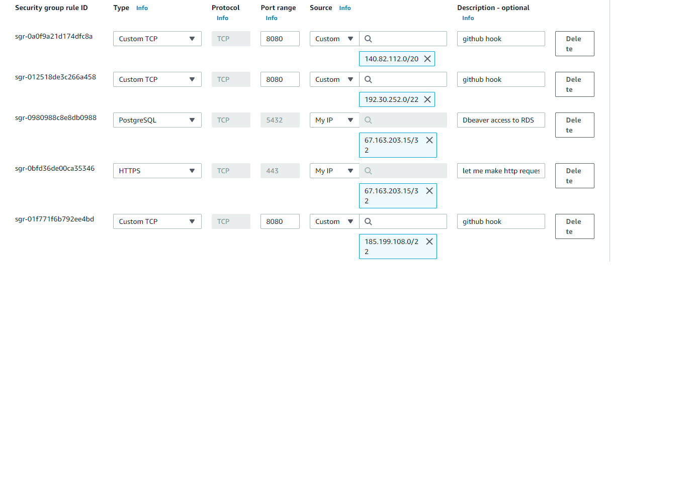
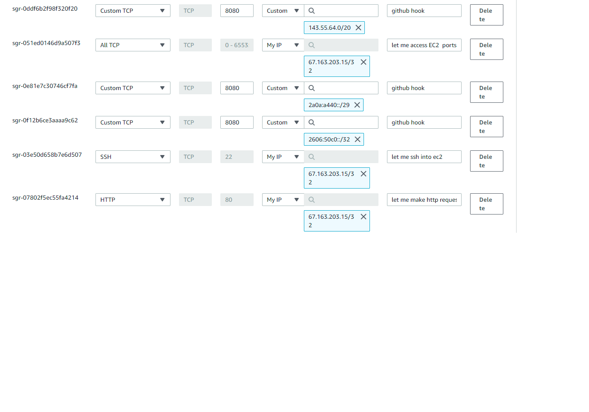

# CI Pipeline Instructions
## Set up EC2
- create EC2 instance (Free tier amazon linux)
    - select the free tier instance type
    - leave default settings for configure instance
    - leave default settings for add storage
    - add a name tag if you wish 
    - set up security groups (create it now or use a premade one)
        - need to allow the following inbound rules:
            - HTTP and HTTPS for your IP address
            - Custom TCP for instance ports (allow all for ease of use) for your IP address
            - PostgreSQL for your Instance (ideally for yourself as well)
            - SSH for your IP address to SSH into your EC2
            - Github API access for githooks
                - custom tcp access for the "hooks" in this list: https://api.github.com/meta

This results in the following HTML:
    - link a key pair with your instance. Create one if you don't have it, and save it somewhere secure
- connect via EC2 Instance Connect or SSH client
- sudo yum -y update
- sudo yum install -y git
- sudo yum install -y java-1.8.0-openjdk-devel
    - depending on project requirements you may need to install a different version of Java
    - if you plan on only implementing CI then also install maven: sudo yum install -y maven
## Set up Tomcat Server and Jenkins
- wget https://dlcdn.apache.org/tomcat/tomcat-9/v9.0.56/bin/apache-tomcat-9.0.56.tar.gz
- tar -zxvf apache-tomcat-9.0.56.tar.gz
    - unzip, extract, verbose, file
- go to conf folder inside apache-tomcat folder
- open tomcat-users.xml in your text editor of choice (vi/vim, nano) (vim file_name.extension)
    - i to edit
    - arrows to navigate
    - esc to finish editing
    - :wq to write and quit
- add role and user (username and password are up to you)
    <role rolename="manager-script" />
    <user username="tomcat" password="tomcat" roles="manager-script" />
    <role rolename="manager-gui" />
    <user username="tom" password="cat" roles="manager-gui" />
- go to tomcat bin folder
- sudo sh startup.sh
    - this starts up tomcat
    - you can go to instance-public-ip:8080 in your browser to see that tomcat is running
- go to webapps folder
- wget http://mirrors.jenkins.io/war-stable/latest/jenkins.war
- in your browser, go to aws-hostname:8080/jenkins
- follow basic setup prompts
    - you will need to find a passcode in your ec2
        - sudo su
            - this command will let you view the hidden file, if you can't see it

- create a freestyle job
- configure git info
    - add git credentials
    - set gitscm polling w/ hooks
- invoke top-level maven targets
    - make sure to select maven install you set up in the Jenkins configuraiton
    - set pom location if it is not in the root folder (should really be in root folder)
    - build steps: clean test package
        - for CD: add these two shell commands:
            - export BUILD_ID=dontkillme
                - leaves application running after build is finished
            - nohup java -jar javaFileInTargetFolder.ext &
            - nohup keeps process running even after exiting build(exiting terminal or shell)
            - & makes the app run in the background
- in your github repo, add webhook payload
    - aws-hostname:8080/jenkins/github-webhook/
        - if you forget the '/' at the end it doesn't like that
- make sure you set an HTTP port 8080 inbound security rule for your IP address if you didn't in step 11, plus add the github webhooks to the list of inbound rules. You can find these IPs on api.github.com/meta under the hooks key
- if manually starting your project, set up your environment variables in your EC2 (might be worthwhile to use printenv to make sure you are not overwritting anything)
    - vim ~/.bashrc (or use whatever editor your prefer)
        - .bashrc sets up the variables for your user
    - export KEY=Value (no spaces between key, =, or value)
    - make sure to :wq so your work is saved
    - source ~/.bashrc will load your environment variables to the session
    - printenv will print all environment variables to the console
- if doing CD or running tests make sure to add environment variables to your jenkins configuration
- push your maven project to your repository
- check jenkins to make sure the build was successful
- send a request through postman or your webpage (make sure any fetch requests are going to the right place) to see your application in action!