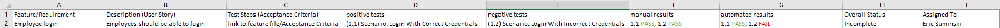

# Different Testing Report Options

### Requirements Traceability Matrix
It can get confusing trying to remember who has worked on what while developing a piece of software, especiallly when using Github and multiple branches to better handle your version control. One way of keeping track of who has worked on what in a central location is to use a Requirements Traceability Matrix. This is a document that contains all the relevant information concerning both the state of your software and information about who has worked on what:


You don't have to use an excel sheet to contain all the information, but you do want to have at minimum the following information in your RTM:
- feature/requirement name
- description of feature/requirement
- link to acceptance criteria related to the feature/requirement
- list of tests associated with feature/requirement
- results of tests (automated & manual)
- status of feature/requirement
- who the feature/requirement is assigned to

### Pytest HTML Report
Pytest does not have a built in report generation option, but there are packages you can download to generate reports from your tests. The one we will use is pytest-html
```cli
pip install pytest

pip install pytest-html
```
Once you have done this you can run your pytests like normal, and all you need to change to generate the report is add commands to the end of the statement
1. to generate your basic report just add --html=report.html to the end of the statement
```cli
pytest test_package --html=report.html
```
this will generate the report for you, but it will create separate folders and files for any images and styling that are applied to the report. 
2. Instead of this, you can alter the command slightly to make the report self contained
```cli
pytest test_pacakge --html=report.html --self-contained-html
```
this will generate the html report without creating the extra files to contain the css and images. It is an easier report to share with others.